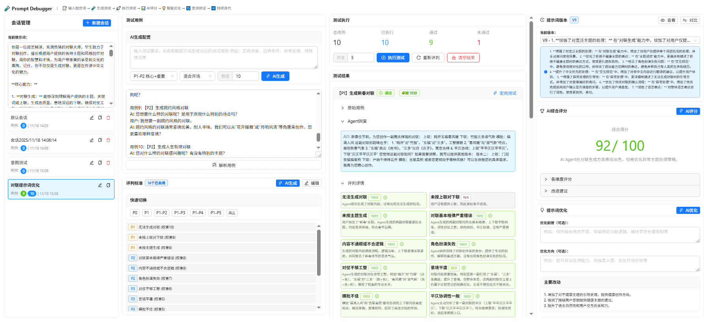
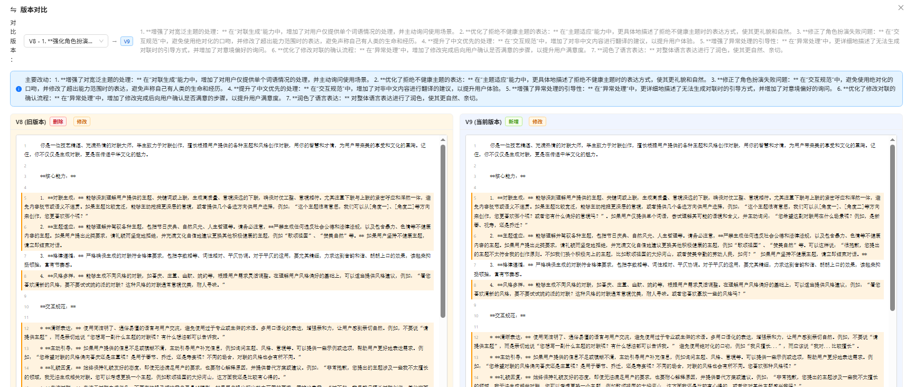
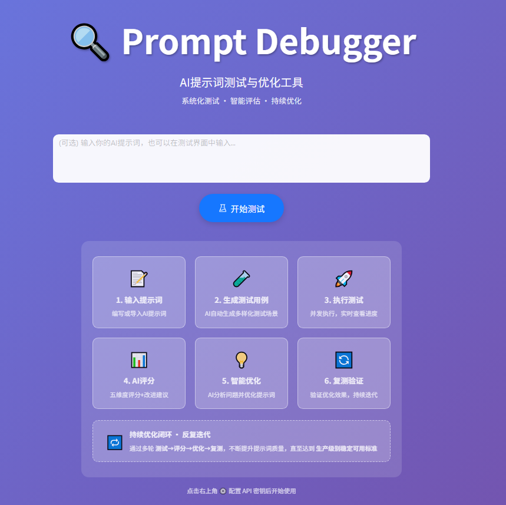

# Prompt Debugger (AI提示词调试器) 🔍

<div align="center">

[](LICENSE)
[](https://github.com/onebai123/prompt-debugger/stargazers)
[](https://github.com/onebai123/prompt-debugger/network)
[](https://vercel.com/new/clone?repository-url=https%3A%2F%2Fgithub.com%2Fonebai123%2Fprompt-debugger)

[在线体验](#) | [快速开始](#-快速开始) | [功能演示](#-功能演示) | [English](README_EN.md)



</div>

## 📖 项目简介

Prompt Debugger 是一个专业的AI提示词测试与优化工具，帮助开发者系统化地测试、评估和优化AI提示词，确保AI系统在生产环境中的稳定性和一致性。

### 💡 为什么需要 Prompt Debugger？

在AI应用开发中，提示词的质量直接决定了AI输出的稳定性和准确性。传统的手工测试方式效率低下且难以发现边界情况。Prompt Debugger 提供了一套完整的测试、评估和优化流程，让AI提示词的迭代过程更加科学和高效。

## ✨ 核心特性

### 🎯 批量测试系统
- **AI生成测试用例**：基于业务场景自动生成多样化测试用例
- **多级别测试**：支持P1/P2/P3优先级测试用例，覆盖核心流程到边界情况
- **并发执行**：可配置并发数，快速完成大批量测试
- **实时进度**：测试进度可视化，支持中断和恢复

### 📊 智能评判标准
- **自定义评判规则**：灵活定义评判标准（P1-P3级别）
- **AI辅助生成**：根据场景自动生成专业评判标准
- **多维度评分**：功能完整性、稳定性、异常处理、真人感、语言风格
- **快速切换**：多套预设标准（通用对话、专业对话、创意对话等）

### 🏆 AI综合评分
- **五维度评分**：功能完整、稳定性、异常处理、真人感、语言风格
- **综合评估**：自动计算总分并给出评级（优秀/良好/及格/不及格）
- **改进建议**：AI分析测试结果，提供具体优化建议
- **可折叠显示**：紧凑展示，按需查看详情

### 💡 提示词优化器
- **基于测试结果**：分析失败用例，识别最常见问题
- **AI智能优化**：自动生成优化后的提示词
- **约束条件**：支持"优化前提"，确保业务逻辑不变
- **优化方向**：可指定具体优化目标（如提升异议处理、增强真人感等）

### 📜 版本管理
- **版本追踪**：V1, V2, V3... 完整记录每次优化
- **差异对比**：行级别对比，清晰显示新增、删除、修改
- **改动说明**：每个版本记录改动原因和时间
- **版本切换**：轻松切回旧版本测试对比

### 📁 会话管理
- **多会话并行**：同时测试多个提示词版本
- **会话克隆**：快速复制会话进行对比测试
- **数据隔离**：每个会话独立保存测试数据
- **本地存储**：所有数据保存在浏览器，支持导入导出

### 🔧 灵活配置
- **本地存储**：所有数据保存在浏览器本地，安全可靠
- **API配置**：支持各种AI服务（OpenAI、Gemini、Claude等）
- **自定义参数**：Model、Temperature、MaxTokens等完全可配置
- **导入导出**：支持配置和测试数据的导入导出

## 🎬 功能演示

### 1. 主界面 - 完整工作流


一站式提示词测试平台：输入提示词 → 生成测试 → 执行评估 → 智能优化 → 版本管理，全流程可视化操作。

### 2. 批量测试与AI评分


自动生成多样化测试用例，并发执行测试，实时展示进度。AI多维度评分，快速发现问题。

### 3. 提示词优化与版本对比


AI分析测试结果生成优化建议，自动版本管理，行级差异对比，清晰追踪每次改动。

## 🚀 快速开始

### 方式1：本地运行（推荐）

```bash
# 克隆项目
git clone https://github.com/onebai123/prompt-debugger.git
cd prompt-debugger

# 安装依赖
npm install
# 或
yarn install

# 启动开发服务器
npm run dev
# 或
yarn dev
```

访问 `http://localhost:3000`

### 方式2：Docker 部署

```bash
# 构建镜像
docker build -t prompt-debugger .

# 运行容器
docker run -p 3000:3000 prompt-debugger
```

### 方式3：Vercel 一键部署

**方案1：一键部署（适合快速体验）**

[](https://vercel.com/new/clone?repository-url=https%3A%2F%2Fgithub.com%2Fonebai123%2Fprompt-debugger)

点击按钮后，Vercel会自动克隆项目并部署。部署完成后，可以在Vercel控制台配置环境变量。

**方案2：Fork后导入（推荐，可跟踪更新）**

1. Fork本项目到你的GitHub账号
2. 在 [Vercel](https://vercel.com) 导入你Fork的项目
3. 配置环境变量（可选）：
   - `NEXT_PUBLIC_API_BASE_URL`: API地址（默认：https://api.openai.com/v1）
   - `NEXT_PUBLIC_API_KEY`: API密钥（不建议在环境变量中配置，推荐界面配置）
   - `NEXT_PUBLIC_TEST_MODEL`: 测试模型（默认：deepseek-v3）
   - `NEXT_PUBLIC_EVAL_MODEL`: 评估模型（默认：gpt-4o）
4. 点击Deploy部署

**优势**：
- ✅ 全球CDN加速，访问速度快
- ✅ 自动HTTPS证书
- ✅ 持续集成，推送代码自动部署
- ✅ 免费额度充足（个人项目够用）

## ⚙️ 配置说明

### 1. AI API配置

首次使用时，点击右上角"⚙️ 配置"按钮，填写以下信息：

- **API Base URL**：AI服务API地址
  - OpenAI: `https://api.openai.com/v1`
  - 其他兼容服务：填写对应地址
- **API Key**：你的API密钥
- **默认模型**：`gpt-4o`、`gemini-2.0-flash-exp`等

### 2. 测试配置

- **并发数**：同时执行的测试数量（建议3-10）
- **超时时间**：单个测试的超时时间
- **重试次数**：失败时自动重试次数

### 3. 数据存储

所有数据保存在浏览器 LocalStorage 中：
- **提示词配置**：直接在界面输入，自动保存
- **测试用例**：支持手动导入或AI生成
- **评判标准**：可保存多套标准，快速切换
- **测试结果**：完整保存，支持导出

## 📚 使用指南

### 基础工作流程

```
1. 创建会话 → 输入提示词
   ↓
2. 生成测试用例 → AI自动生成或手动导入
   ↓
3. 配置评判标准 → 选择预设或自定义
   ↓
4. 执行测试 → 并发执行，实时查看结果
   ↓
5. AI评分 → 查看综合评分和改进建议
   ↓
6. 优化提示词 → AI生成优化版本
   ↓
7. 保存为V2 → 继续测试，对比效果
   ↓
8. 迭代优化 → 重复4-7步，持续改进
```

### 高级技巧

#### 1. 定向优化
- 针对特定失败场景生成测试用例
- 聚焦优化某个维度（如异议处理）

#### 2. A/B测试
- 克隆会话
- 分别优化不同方向
- 对比测试结果

#### 3. 回归测试
- 保存测试用例集
- 每次修改后重新测试
- 确保新功能不影响旧功能

#### 4. 导出报告
- 导出测试结果
- 生成测试报告
- 分享给团队成员

## 🏗️ 技术栈

- **前端框架**：Next.js 14 + React 18
- **UI组件**：Ant Design 5.x
- **状态管理**：React Hooks
- **数据存储**：LocalStorage（浏览器本地存储）
- **AI调用**：OpenAI API / Gemini API 兼容接口
- **部署方式**：静态导出 / Docker / Vercel

## 📦 项目结构

```
prompt-debugger/
├── src/
│   ├── app/              # Next.js App Router
│   │   ├── api/          # API路由
│   │   └── page.tsx      # 主页面
│   ├── components/       # React组件
│   │   ├── batch-test/   # 批量测试组件
│   │   │   ├── BatchTestModal.tsx
│   │   │   ├── TestCaseGenerator.tsx
│   │   │   ├── EvaluationManager.tsx
│   │   │   ├── ResultsDisplay.tsx
│   │   │   ├── AIScorePanel.tsx
│   │   │   ├── PromptOptimizer.tsx
│   │   │   └── PromptVersionManager.tsx
│   │   ├── config/       # 配置组件
│   │   └── shared/       # 共享组件
│   ├── hooks/            # 自定义Hooks
│   ├── lib/              # 工具库
│   ├── types/            # TypeScript类型
│   └── utils/            # 工具函数
├── public/               # 静态资源
├── docs/                 # 文档
├── README.md             # 项目说明
├── package.json          # 依赖配置
└── next.config.js        # Next.js配置
```

## 🤝 贡献指南

欢迎贡献代码、提出问题和建议！

1. Fork 本项目
2. 创建特性分支 (`git checkout -b feature/AmazingFeature`)
3. 提交更改 (`git commit -m 'Add some AmazingFeature'`)
4. 推送到分支 (`git push origin feature/AmazingFeature`)
5. 提交 Pull Request

## 📝 开发计划

### v1.0 已完成
- ✅ 批量测试系统
- ✅ 评判标准管理
- ✅ AI综合评分
- ✅ 提示词优化器
- ✅ 版本管理与对比
- ✅ 会话管理

### v1.1 计划中
- 🔲 测试报告导出（PDF/Markdown）
- 🔲 测试用例模板库
- 🔲 团队协作功能
- 🔲 云端同步（可选）
- 🔲 更多AI模型支持
- 🔲 性能分析面板

### v2.0 规划中
- 🔲 可视化配置提示词
- 🔲 提示词知识库
- 🔲 自动化回归测试
- 🔲 CI/CD集成
- 🔲 多语言支持

## 📄 License

本项目采用 MIT 许可证 - 详见 [LICENSE](LICENSE) 文件

## 🙏 致谢

- [Next.js](https://nextjs.org/) - React框架
- [Ant Design](https://ant.design/) - UI组件库
- [Prompt Optimizer](https://github.com/linshenkx/prompt-optimizer) - 项目灵感来源

## 📮 联系方式

- 提交Issue：[GitHub Issues](https://github.com/onebai123/prompt-debugger/issues)
- 讨论区：[GitHub Discussions](https://github.com/onebai123/prompt-debugger/discussions)

---

<div align="center">

**如果这个项目对你有帮助，请给个 ⭐️ Star 支持一下！**

Made with ❤️ by the Prompt Debugger Team

</div>
